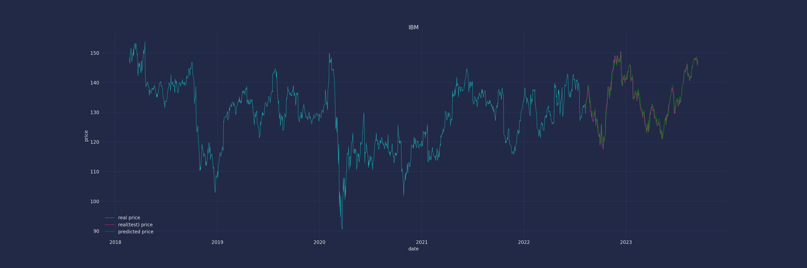
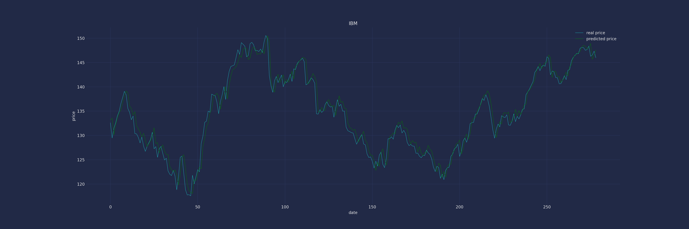
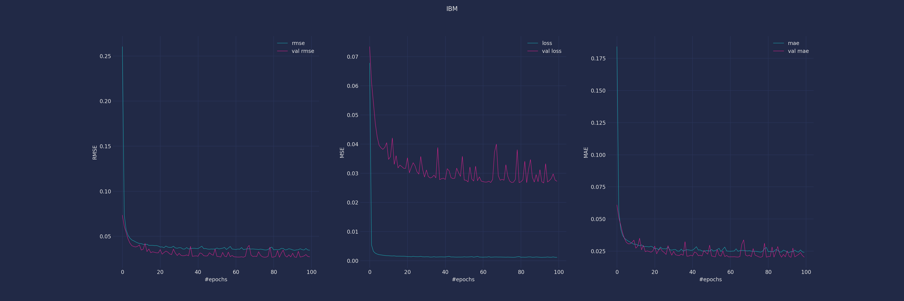
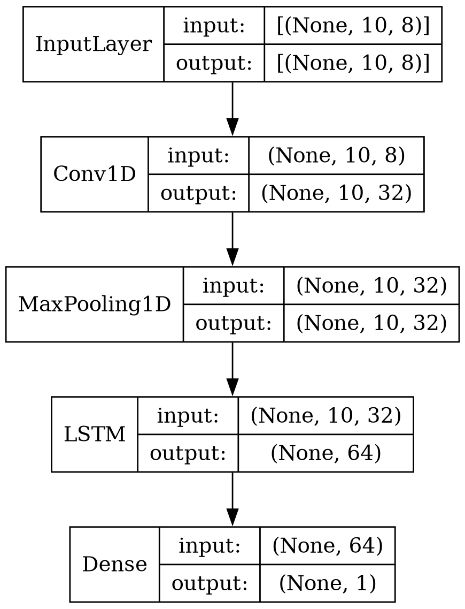

# A CNN-LSTM-Based Model to Forecast Stock Prices
Implemnetation of following paper to predict stock market price via CNN-LSTM.
here is the paper [A CNN-LSTM-Based Model to Forecast Stock Prices](https://downloads.hindawi.com/journals/complexity/2020/6622927.pdf).

## predicting IBM stock price

IBM real(train and test) price vs predicted price

IBM test price vs predicted price

predicted evaluation (rmse, mse, mae metrics)

## architecture of the CNN-LSTM model

